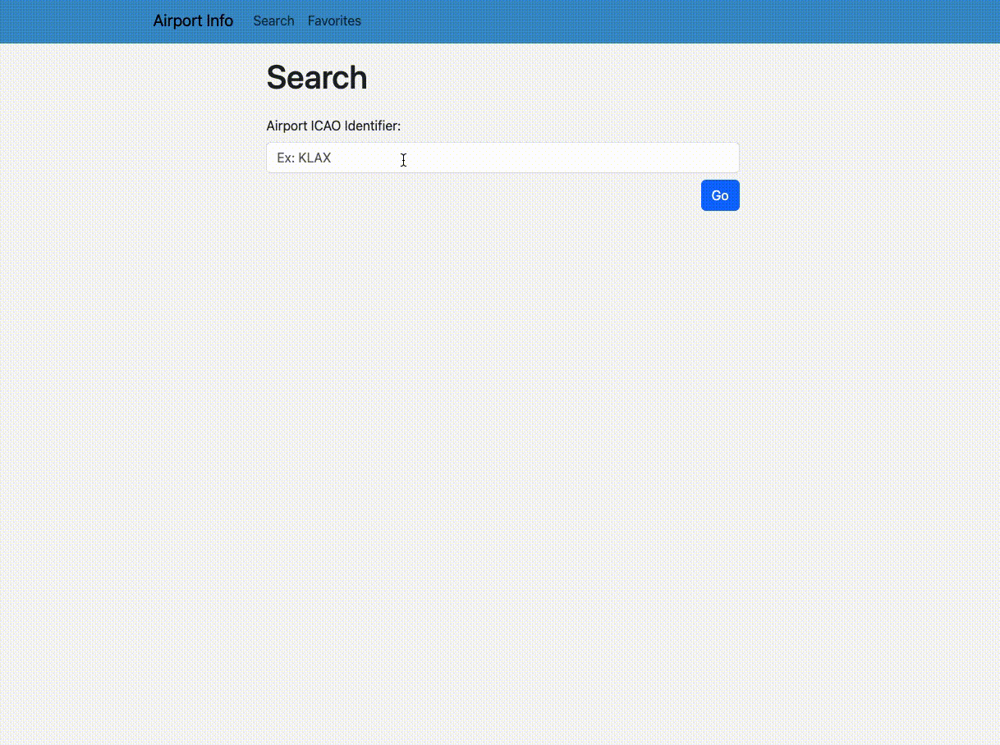

# airport-info

A JavaScript application for pilots who want to view airport weather.

## Why I Built This

As a licensed pilot, I wanted to build an application that shows a simple breakdown of airport METAR data.

## Technologies Used

- Bootstrap 5
- JavaScript
- HTML5
- CSS3

## Live Demo

Try the application live at [https://parkersiu.github.io/ajax-project/](https://parkersiu.github.io/ajax-project/)

## Features

- Pilots can search for an airport.
- Pilots can view the most recently reported airport weather.
- Pilots can add an airport to their favorites list.
- Pilots can view their favorites list.
- Pilots can delete airports from their favorites list.

## Stretch Features

- Pilots can view the airport diagram.
- Pilots can view airport forecast weather.

## Preview



### Getting Started

1. Clone the repository.

    ```shell
    git clone https://https://github.com/parkersiu/ajax-project
    cd ajax-project
    ```


1. Once the repo is cloned, you can open the application using `live server` or your chosen project opener.
